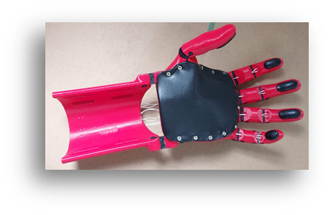

# Open-Source Pediatric Hand Prosthesis (v4)

This repository documents the ongoing development of a lightweight, low-cost, and child-friendly 3D-printed hand prosthesis for a 9-year-old. The project started as part of a mechanical engineering course at TU Berlin and is actively being developed further.

\
*Figure: Final design of the prosthetic hand (v4)*

---

## Project Background

The prosthesis is designed to be operated via wrist flexion and provide basic gripping functionality to support everyday activities. It is inspired by existing open-source prosthetic designs, especially from the [e-NABLE community](https://enablingthefuture.org/), and is built using accessible materials and FDM 3D printing.

---

## Project Goals

- **Individually adaptable** to user anatomy
- **Inexpensive** to produce (low-cost and standard materials)
- **Scalable and reproducible** for broader accessibility
- **Withstanding daily use**: robust, washable, skin-friendly
- **Comfortable and ergonomic**
- **Easily modifiable** and "grows" with the child
- **Printable on common FDM printers** with standard materials (PETG, TPU)

---

## Current Design Version: v4

The fourth generation (`v4`) of our design includes:

- ✅ Redesigned grip surfaces for better everyday usability
- ✅ Strong but flexible joints using TPU
- ✅ Custom string tension system (mechanical clamp)
- ✅ Modular components (easy replacement, adjustability)
- ✅ Printed using **PETG** and **TPU**, with **Dyneema®** cords

See [`/v4_final_design`](./v4_final_design/) for all STL files, assembly notes, and material details.

---

## Optimization Focus Areas

We evaluated and improved key components through iterative testing:

- `material-selection/` — optimal filament + cord materials (PETG, Dyneema)
- `finger-design/` — grip geometry & modularity
- `joint-mechanism/` — strength vs. complexity
- `band-routing/` — minimizing friction and response delay
- `tensor-system/` — new back-tensioner design
- `grip-surface/` — various high-friction materials tested
- `fit-scaling/` — adaptive sizing for different users

Detailed discussions and test results can be found under [`/optimization`](./optimization/).

---

## Repo Structure

| Folder | Description |
|--------|-------------|
| `docs/` | Documentation and project presentation (PDF) |
| `v4_final_design/` | All current STL files and build instructions |
| `optimisation/` | Subfolders for each tested feature/improvement |
| `resources/` | Source models from e-NABLE, literature references |

---

## Credits & Acknowledgements

We gratefully acknowledge the open-source foundation by:

- [e-NABLE Kinetic Hand](https://www.thingiverse.com/thing:4618922)
- [Flexy-Hand by Gyrobot](https://www.thingiverse.com/thing:380665)

This project was developed by:
- Kristina Leberer  
- Sascha Thiede  
- Jonte Fricke  

as part of the course **"3D-Druck in der Mechanik"** at TU Berlin, supervised by **Prof. Dr. C. Völlmecke**, **Yating Ou (M.Sc.)**, and **Narges Panjalipoursangari (M.Sc.)**.

---

## Status

🟢 **v4 complete and functional**  
 - Further enhancements (grip elements, heat shrink tube, print-in-place design) in development.
- We're not in yet in contact with e-NABLE, but we plan to share our findings with them directly.

---

## Contact

For questions, feedback or collaboration proposals, feel free to open an issue or contact us directly.

---
