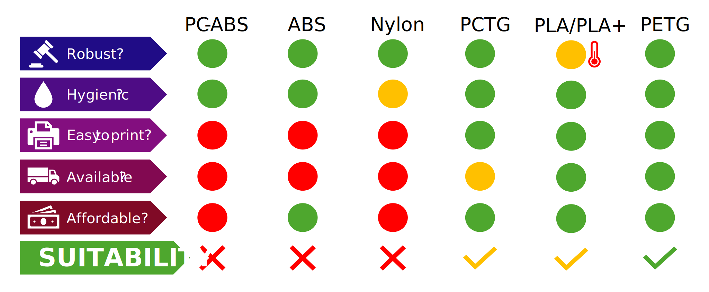
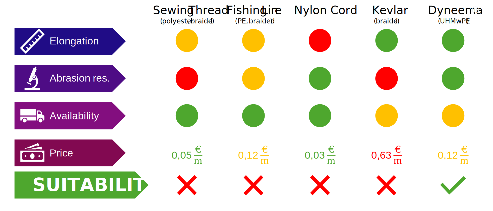

# 🧪 Material Selection

This section outlines the material selection process for the prosthetic hand, focusing on both the printed structural components and the cord system. Our goal was to ensure all materials used are suitable for a child-friendly prosthesis — considering **cost**, **availability**, **printability**, **durability**, and above all, **user safety**.

---

## 🖨️ Prosthesis Body

The base components of the prosthesis are produced via **FDM 3D printing**. Suitable materials must be:

- Non-toxic and skin-safe (biocompatible)
- Printable on standard consumer printers (no heated chamber)
- Mechanically durable and impact-resistant
- Resistant to cleaning agents and moderate heat
- Cost-effective and easily sourced (available in maker spaces)

We compared several common 3D printing materials:

  
*Figure: Extract from project presentation slide (July 2025)*

### 🔍 Summary of Key Findings

- **PLA / PLA+**: Very easy to print and affordable, but insufficient temperature resistance. Risk of deformation in hot environments (e.g. car interiors).
- **PETG**: Excellent compromise — better temperature resistance and impact toughness than PLA. Widely available, inexpensive, and easy to print. Chosen as the **main body material**.
- **TPU**: Used selectively for **flexible joints**, due to high elasticity and fatigue resistance.
- **PCTG** *(emerging)*: Similar to PETG, but with improved impact strength and chemical resistance. Promising candidate for future iterations — could enable printed-in-place joints — but still slightly more expensive and less common.

---

## 🧵 Cord System

The cord system is a critical mechanical component: it transmits motion from the wrist to the fingers. Material selection here directly affects **grip strength**, **responsiveness**, and **long-term reliability**.

  
*Figure: Extract from project presentation slide (July 2025)*

### 🔍 Summary of Key Findings

- **Nylon cords**: Too elastic — leads to energy loss and reduced grip strength.
- **Kevlar**: Strong, but prone to abrasion damage when routed through plastic guides.
- **Braided fishing line (PE)**: Commonly used in e-NABLE designs. Affordable and widely available, but variable in quality.
- **Dyneema® (UHMwPE)**: Exceptional strength-to-weight ratio, low friction, and almost no stretch (~3%). Extremely abrasion-resistant and ideal for compact tendon paths.  
  → Chosen as our **preferred material** (used: 0.4 mm diameter).

If Dyneema® is not available, we recommend using a **braided polyethylene fishing line** with a diameter of **0.3–0.5 mm** as a fallback.

---

## 📌 Summary of Material Choices

| Component            | Material | Reason                                             |
|---------------------|----------|----------------------------------------------------|
| Main body           | PETG     | Strong, heat-resistant, widely available           |
| Joints              | TPU      | High elasticity, durable under repeated bending    |
| Tendon cords        | Dyneema® | Minimal stretch, high durability, low friction     |

---

## 📎 References

- Internal presentation slide (July 2025): *Material Comparison*
- [e-NABLE community](https://enablingthefuture.org/) – Open-source prosthetic models  
- [Dyneema® product data](https://www.dsm.com/dyneema) – DSM Engineering Materials  
- Mat Bowell, [Kinetic Hand STL](https://www.thingiverse.com/thing:4618922)  
- Steve Wood, [Flexy-Hand STL](https://www.thingiverse.com/thing:380665)

---
