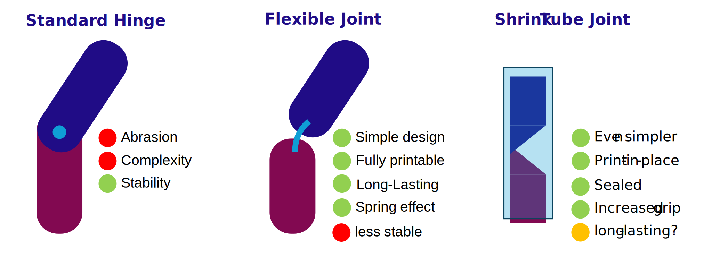
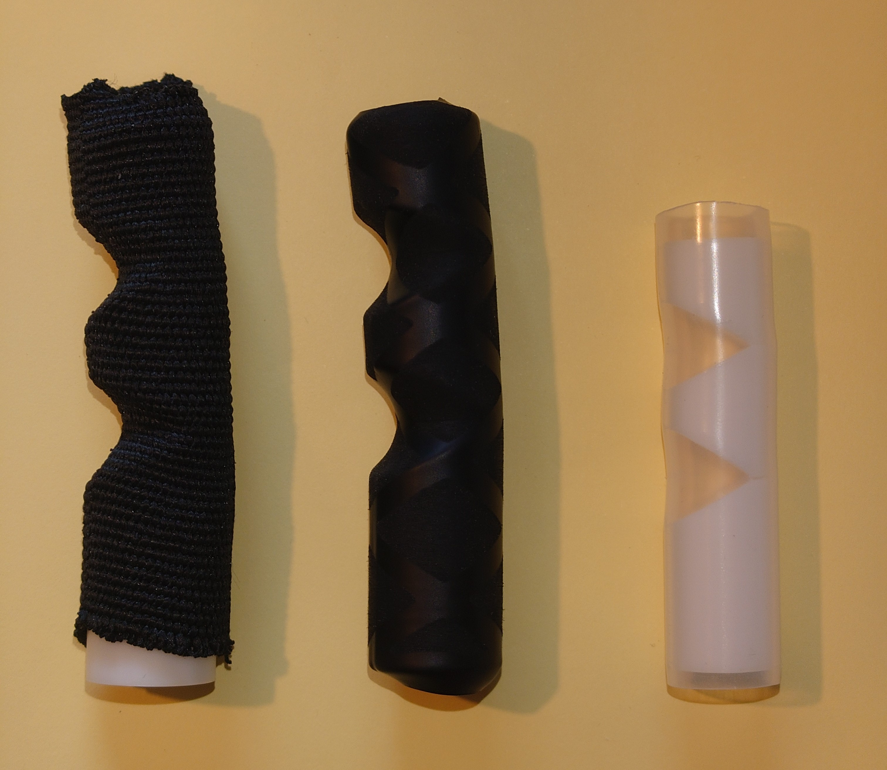

# Joint Configuration

This section documents our evaluation of joint types used in the prosthetic fingers and palm. Finger joint design is critical to achieving a balance between stability, flexibility, durability, and ease of assembly.

We compared three joint types:

- **Flexible printed hinges (default TPU design)**  
- **Flexible joints with shrink tubing**  
- **Standard mechanical (pinned) joints**

---

## Overview of Joint Types

*Figure: Extract from project presentation slide (July 2025)*

---

## Why We Didn't Use Shrink Tubing (Yet)

Although the shrink-tube joint is promising — especially due to the clean look and quick assembly — we encountered **several material challenges**:

- Most common shrink tubing (polyolefin) is too **stiff** in larger diameters
- Wall thickness becomes problematic for our small-scale parts
- We ordered alternative materials: **braided PET tubing** and **thin silicone tubing**, but delivery was pending at the time of the current version (`v4`)
- Further material testing is planned — this joint type may still become a viable option for future versions

**Update (2025-07-31): Our Shrinking Tube order arrived**\
We tested:
- **Braided PET tubing**: Works in general, but sto stiff, not enough grip and not waterproof
- **PVC grip tubing (for fishing rod handles)**: Works exceptionally well, nice and thin, flexible, much better grip than polyelofin tubing, but PVC might contain harmful chemicals.
- **Silicone tubing (non-shrink, food grade)**: Works well, fit is a bit loose, because it does not shrink, we were not able to source larger diameters than ID 12 mm, OD 14 mm yet without thicker walls.

*Figure: Print-in-place shrink tube joint test finger with braided PET tubing (left), PVC grip tubing (middle), and silicone tubing (right).*

Our current tests of this new joint type are very promising. Especially the PVC grip tubing works very well and provides reliable re-opening of the finger, but we are still concerned about the chemicals in PVC. The silicone tubing is a good alternative, although a bit stiff, and we need to find a source for larger diameters with thin walls. Furthermore, we need to test the long-term wear resistance, as non of these tubings are designed for repeated bending. Once these tests are complete, we can work on a print-in-place finger design that uses the shrink tube joint.

*Figure: Bending test of PVC grip tubing joint. The joint opens reliably, but we need to test long-term wear resistance.*

---

## ✅ Current Decision

For our current build (v4), we are using the **default flexible TPU joints** provided in the Kinetic Hand design. We optimized the **print settings** for these joints (infill, wall count, material choice) to ensure:

- Smooth opening motion after gripping
- Adequate flexibility for kid’s strength
- Durability over extended use

---

## Print Settings for TPU Joints

| Parameter         | Value / Recommendation         |
|-------------------|--------------------------------|
| Layer height      | 0.2                            |
| Wall/perimeter    | 3                              |
| Infill            | 30 %                           |
| Print speed       | 30 mm/s                        |
| Material used     | TPU (Shore A 90)               |

Please note that the actual print settings vary and depend on your specific TPU brand and printer configuration. The goal is to tune the strength of the joints so that the hand will reopen completely with no unnecessary increase in required closing force.

---

## Next Steps

We plan to revisit the shrink tube approach, given that our new material has arrived. Our goal is to evaluate:

- Long-term wear resistance
- Assembly effort
- Performance under repetitive motion

Furthermore, we will run more tests with **PCTG** as a potential joint material, which would enable us to print the entire hand in one piece, eliminating the need for joints altogether.

---

## References

- [Kinetic Hand on Thingiverse](https://www.thingiverse.com/thing:4618922) — original joint design
- Internal presentation slide (July 2025): *Comparison of joint types*
