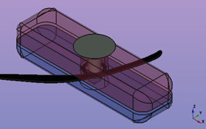

# Tensor System

This section documents the design and motivation behind our custom **string tensioner system**. The tensioners are a crucial part of the prosthesis: they enable adjustment of the tendon cords that actuate the fingers via wrist movement.

---

## Standard Tensioner (Kinetic Hand Design)

The official Kinetic Hand assembly manual describes a multi-step process for installing and calibrating the tendon cords using **flexible tensioners**:

1. Screw the flexible tensioners into the gauntlet at one of several predefined positions.
2. Tie the tendon cord around the tensioner, initially with **temporary slip knots**.
3. Manually test the finger closure (adjusting for timing and symmetry).
4. Tie **permanent knots** (surgeon’s knot), apply **super glue**, and trim.
5. Optionally reposition the tensioners for final calibration.

**Drawbacks:**
- Requires **both hands** to tie knots and make adjustments.
- Tuning process is **time-consuming and difficult to repeat**.
- Knots and glue introduce **irreversible steps**.
- wear on screw holes with repeated adjustments.

*See the official assembly instructions (Step 12–21) for full procedure.*

*Figure: Standard tensioner system from Kinetic Hand assembly manual, but with bow instead of surgeon’s knot during prototyping.*

---

## Our Custom Tensioner Design

To make the system more **user-friendly, reliable, and adjustable**, we designed a **two-part mechanical clamp** that holds the tendon in place by friction.

### Key Features:
- No knots or glue required
- Fully **adjustable with one hand**
- Uses only **a single M2 screw**
- Cords can be inserted, tightened, and re-tensioned **without tools**
- Reversible and reusable (decreases wear on screw holes)

### How It Works:

The custom tensioner consists of:
- A **base part** with a guide channel
- A **cap part** that clamps the tendon in place
- One **M2 screw** that connects both parts and compresses the cord

The cord is routed around the screw shaft and sandwiched between the two halves. As the screw is tightened, friction secures the cord firmly in position. To adjust, the screw is loosened slightly, the cord is pulled or released, and the screw is re-tightened.

{: width="100"}

  
  

*Figure: Isometric view of the new custom tensioner design.*

---

## Assembly Instructions

1. Insert the tendon cord into the guide path in the **base part**.
2. Loop the cord around the central screw hole.
3. Place the **cap part** on top.
4. Insert and tighten the **M2 screw** gently until resistance is felt.
5. Test the finger actuation.
6. Adjust by loosening and repositioning the cord as needed.

---

## Advantages at a Glance

| Feature                   | Standard System        | Custom Tensioner       |
|---------------------------|------------------------|-------------------------|
| Tool-free adjustment      | ❌ No                  | ✅ Yes                  |
| Requires knot tying       | ✅ Yes                 | ❌ No                   |
| Requires glue             | ✅ Yes                 | ❌ No                   |
| One-handed operation      | ❌ No                  | ✅ Yes                  |
| Reusability               | ❌ Limited             | ✅ High                 |

---

## Files & Resources

- [`tensioner_custom_v1.step`](./tensioner_custom_v1.step) – Full CAD model
- [`tensioner_custom_v1.stl`](./tensioner_custom_v1.stl) – Ready to print

---

## Future Improvements

- Incorporate quick-release or snap-fit features for even faster cord swaps
- or increase longevity of screw holes, consider using a **threaded insert** instead of direct threads in the plastic

---
