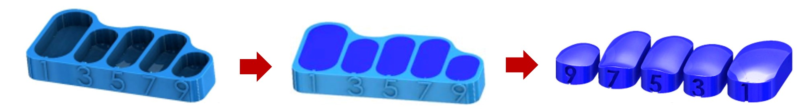
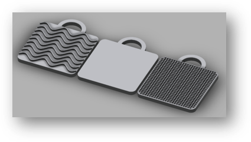
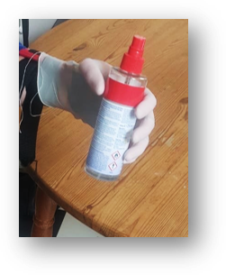
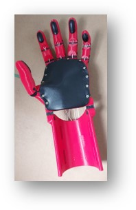
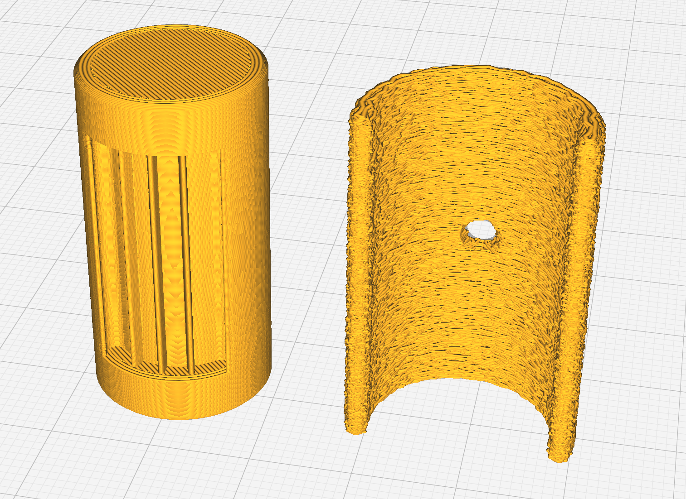
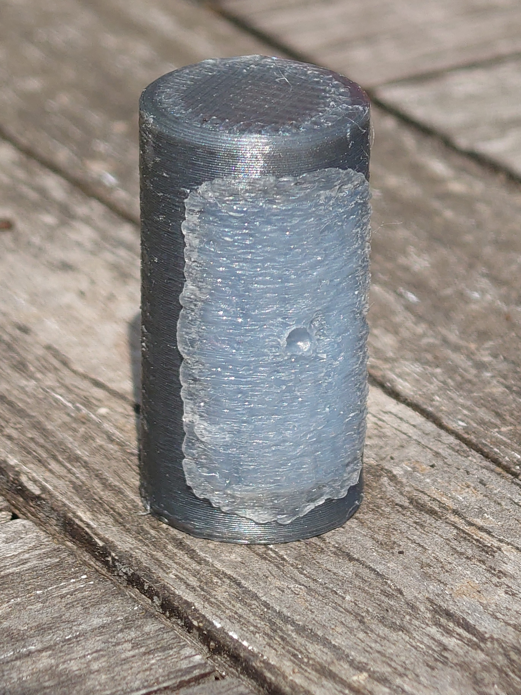

# Grip Surface Optimization

This section documents our experiments with grip surface solutions to enhance the functionality of the prosthetic hand. Grip performance is critical for tasks like holding bottles, pens, or toys — especially for a child user.

While the Flexy-Hand used **smooth contact areas**, the default model for the Kinetic Hand has recommends two-component silicone or flexible filament inserts, these solutions come with significant drawbacks. We explored several alternatives — including a **custom hot glue in-place injection moulding** process developed during the project.

---

## Official Recommendations

The Kinetic Hand assembly guide suggests two main grip-enhancing approaches:

### 🔸 Silicone Inserts (Two-Part Silicone)

- **Method**: 3D print moulds and cast custom inserts
- **Material**: Skin-safe silicone, Shore A 25–45
- **Estimated Cost**: ~27 € for 500 g (no smaller sets available)
- **Pros**: High grip, skin-safe, durable
- **Cons**: Expensive, high effort, wasteful for small production

*Figure: Printed silicone moulds for two part silicone (Image Source: Kinetic Hand Assembly Manual, Rev. 9/10/2020).*

---

### 🔸 Printed Grip with Ninjaflex

- **Method**: Print grip pads directly in ultra-flexible filament
- **Material**: Ninjaflex (Shore A ~85)
- **Estimated Cost**: ~30 € per 250 g spool
- **Pros**: Fully integrated into the model, good grip
- **Cons**: Very hard to print, not standard on most printers

*Figure: Example of Ninjaflex grip pads (Image Source: Kinetic Hand Assembly Manual, Rev. 9/10/2020).*

---

## Our Experiments & Alternatives

We tested several cost-effective and accessible alternatives, aiming for low manual effort, minimal cost, and wide availability.

---

### 🟠 1. Textured TPU Surface

- **Method**: Printed a grip surface with modeled texture using more affordable stanard TPU (Shore A ~90)
- **Pros**: Fully printable, no extra steps
- **Cons**: Too slippery; texture ineffective at this scale (on FDM printers)

---

### 🟠 2. Full-Hand Latex Glove

- **Method**: Stretch a latex glove over the entire hand
- **Pros**: Good grip, instant coverage
- **Cons**: Not breathable → makes skin sweaty; less durable

---

### 🟢 3. Thick Latex Pads (Upcycled Material)

- **Method**: Cut grip pads from old latex leggings and glue them onto fingers and palm
- **Pros**: Very effective grip; comfortable; cost-efficient if sourced
- **Cons**: Manual cutting/gluing effort; sourcing may be inconsistent

💡 *This is the current solution used in our v4 prototype.*

---

### ✅ 4. Hot Glue In-Place Injection Moulding *(Experimental – v5 Candidate)*

- **Method**:  
  1. Design fingers with small recessed cavities  
  2. 3D-print a snap-on **injection mould** with a hole and fuzzy skin texture  
  3. Coat mould interior with **sugar water** as a release agent and let it dry  
  4. Snap mould onto finger  
  5. Inject **hot glue (130 °C)** into mould  
  6. Let it cool, remove mould, and rinse off sugar layer

- **Material**: Standard hot glue sticks (~Shore A 80)
- **Pros**:  
  - Extremely grippy  
  - Fast and low-cost  
  - No adhesives needed  
  - Permanent bond to the finger  
  - Moulds are reusable  
- **Cons**:  
  - Requires some heat control  
  - Not yet tested on full hand

\
*Figure: Test finger with snap-on injection mould with fuzzy skin.*\
\
*Figure: Finished hot glue grip after injection and cooling.*

This technique will likely be included in our next version (v5).

---

## Summary of Tested Grip Solutions

| Method                    | Grip Quality | Cost  | Reusability | Required Tools        | Status       |
|---------------------------|--------------|-------|-------------|------------------------|--------------|
| Silicone inserts          | ✅ High       | 🔴 High | ✅ High | Casting tools, silicone| Not used     |
| Ninjaflex print           | ✅ High       | 🔴 High | ✅ High     | Soft-TPU-capable printer | Not used     |
| Textured TPU              | 🔴 Low        | 🟢 Low | ✅ High     | Basic FDM printer       | Rejected     |
| Latex glove               | 🟢 Moderate   | 🟢 Low | 🔴 Low      | None                   | Rejected     |
| Latex pads (upcycled)     | ✅ High       | 🟢 Low | 🟡 Medium   | Scissors, glue         | ✅ Used (v4)  |
| Hot glue injection mould  | ✅ High       | 🟢 Low | ✅ High     | Hot glue gun, mould    | 🔜 v5 planned |

---

## Files & Resources

- `stl/grip_test_finger_with_cavity.stl` – Test finger with moulded grip cavity  
- `stl/hotglue_snap_mould.stl` – Snap-on grip mould 

---

## Learnings & Next Steps

- **Grip surface = critical** to daily usability, especially for small objects
- The **hot glue technique** is our most promising low-cost approach
- thick **latex material** already works well

---
