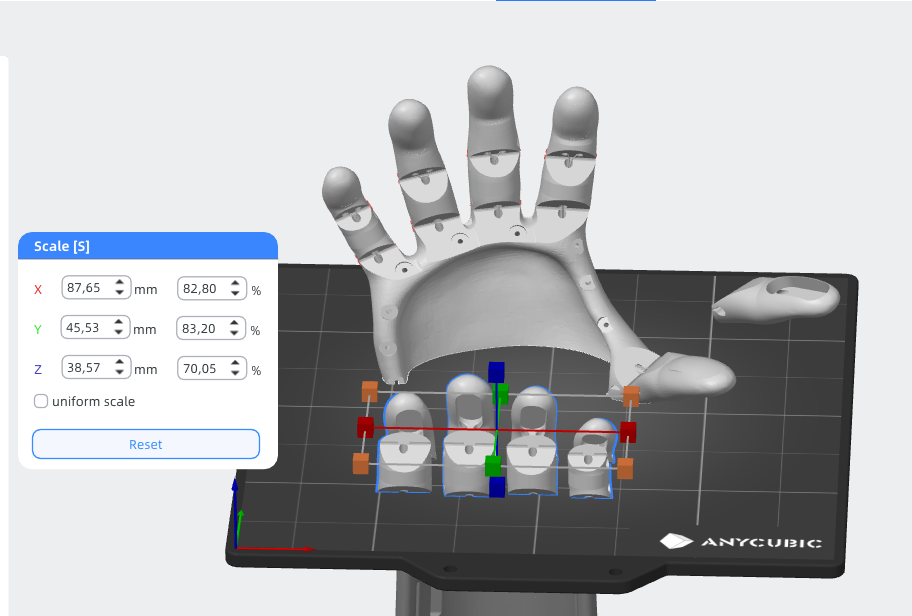
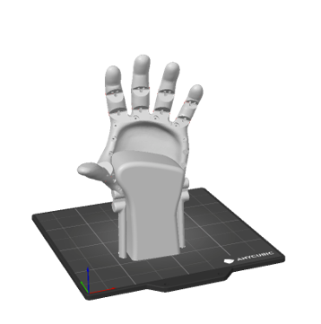

# Fit & Scaling

This section documents our approach to adapting the prosthetic geometry to fit the user's hand, with a focus on **scaling strategy**, **comfort**, and **fit stability**. Ensuring a precise and ergonomic fit is essential for usability — especially for a growing child.

---

## Initial Idea: Non-Proportional Scaling

In our early experiments, we attempted **axis-specific (non-uniform) scaling** to better match the forearm's anatomical proportions. However, this led to multiple problems:

- 🚫 **Tendon channels collapsed** and became non-functional
- 🚫 **Joint geometry distorted**, leading to mechanical issues
- 🚫 **Finger proportions became unnatural and visually awkward**

*Figure: Deformed geometry due to non-uniform scaling*

---

## Final Decision: Proportional Scaling

After encountering the issues with axis scaling, we returned to a simpler and more robust solution: **uniform (proportional) scaling** of the entire model.

- Required **no modifications** to the geometry
- Maintained **functional integrity** of the joints and tendon paths
- Produced a result that **fit our 9-year-old user** well

💡 *We did not need to rely on the sizing tables provided in the official documentation, because sizing was easy in our specfic case.*

---

## Fit Insert: Not Required in Our Case

The Kinetic Hand documentation describes optional **TPU fit inserts** to stabilize the wrist position and prevent the forearm from slipping inside the palm socket.

> *"The Insert is designed to be a soft cushion inside the Kinetic Hand. It stops the partial hand from sliding forward and keeps the wrist at the hinge position. It is shaped as a precise fit into the cavity of the Palm."*  
— *Kinetic Hand Assembly Manual, Step 26*

### Why We Didn't Use It

- Our proportional scaling resulted in a **snug, stable fit** for the user
- No noticeable sliding or discomfort was observed
- The wrist hinge aligned well with the user's joint without additional padding

---

## Alternative Insert Options (Hypothetical)

If an insert had been required, we considered two affordable and low-tech alternatives:

### 1. Kitchen Silicone + Starch Putty (Untested)

- **Method**: Mix **hardware store silicone** with **cornstarch** to form a moldable, skin-safe padding that hardens over time
- **Pros**: Inexpensive, conformal, moldable by hand
- **Cons**: Requires drying time, emits acetic acid while curing

### 2. Foamed TPU (e.g. LW-TPU, Untested)

- **Method**: Print the insert using lightweight or foaming TPU to reduce weight and improve cushioning
- **Pros**: Lightweight, springy, printable
- **Cons**: Expensive, hard to source, needs tuned settings

> *Note: Neither approach was implemented in v4, but both remain valid ideas for future versions or other users with different anatomical requirements.*

---

## Summary

| Approach              | Tested? | Result                                     |
|-----------------------|---------|--------------------------------------------|
| Non-proportional scaling | ✅ Yes  | ❌ Rejected due to geometry and function issues |
| Proportional scaling     | ✅ Yes  | ✅ Used in v4, provided excellent fit       |
| TPU insert (standard)    | ❌ No   | Not needed                                 |
| Silicone putty insert    | ❌ No   | Viable fallback (hypothetical)             |
| Foamed TPU insert        | ❌ No   | Experimental idea for future               |

---

## References

- *Kinetic Hand Assembly Manual*, e-NABLE (Step 26)  
- Internal presentation slides – Fit Scaling,  July 2025 
- Informal guides for DIY silicone putty (silicone + starch)

---
